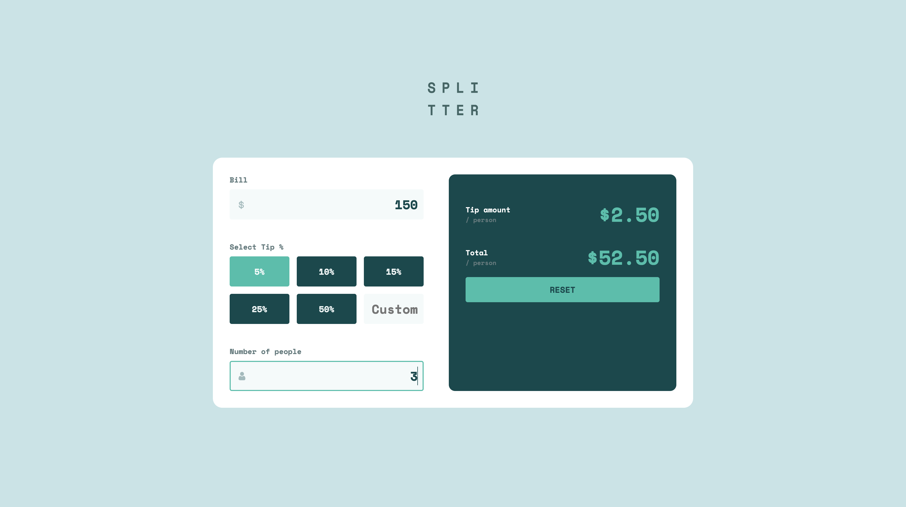
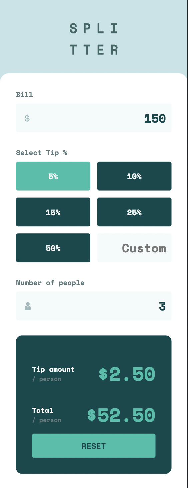

# Frontend Mentor - Tip calculator app solution

This is a solution to the [Tip calculator app challenge on Frontend Mentor](https://www.frontendmentor.io/challenges/tip-calculator-app-ugJNGbJUX). Frontend Mentor challenges help you improve your coding skills by building realistic projects.

## Table of contents

- [Overview](#overview)
  - [The challenge](#the-challenge)
  - [Screenshot](#screenshot)
  - [Links](#links)
- [My process](#my-process)
  - [Built with](#built-with)
  - [What I learned](#what-i-learned)
- [Available Scripts](#available-scripts)
  - [Start](#start)
  - [Build](#build)
- [Author](#author)

## Overview

### The challenge

Users should be able to:

- View the optimal layout for the app depending on their device's screen size
- See hover states for all interactive elements on the page
- Calculate the correct tip and total cost of the bill per person

### Screenshot

### Links

- [GitHub](https://github.com/max1www/tip-calculator)
- [CodeSandbox](https://codesandbox.io/p/github/max1www/tip-calculator/main?file=%2FREADME.md)

## My process

### Built with

- Semantic HTML5 markup
- CSS Variabes
- Flexbox
- CSS Grid
- [React](https://reactjs.org/)
- [Styled Components](https://styled-components.com/)
- [Big.js](https://github.com/MikeMcl/big.js/)

### What I learned

In this project I have been have practice with react framework and styled components.

## Available Scripts

### Start

`npm start`

Runs the app in the development mode.\
Open [http://localhost:3000](http://localhost:3000) to view it in your browser.

The page will reload when you make changes.\
You may also see any lint errors in the console.

### Build

`npm run-script build`

Build the app

## Author

- Telegram - [@max1_www](https://t.me/max1_www)
- Twitter - [@max1_www](https://www.twitter.com/max1_www)
